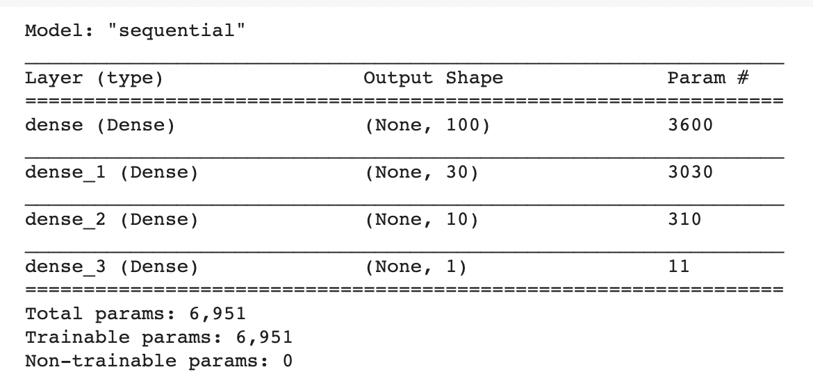
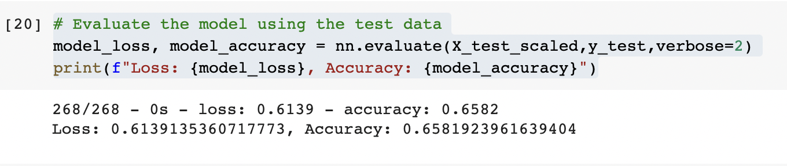
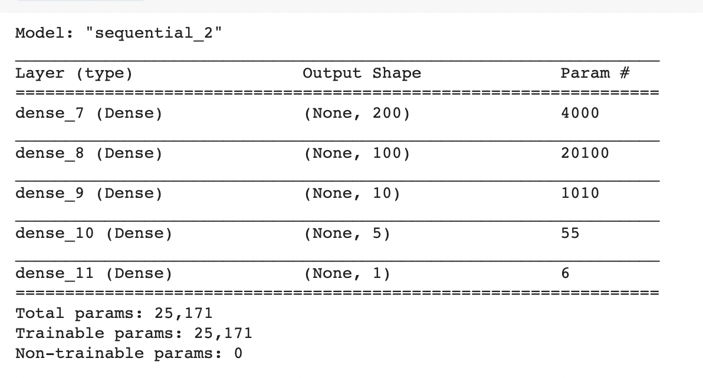
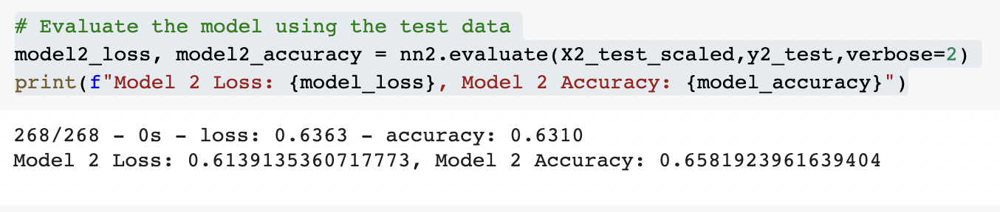
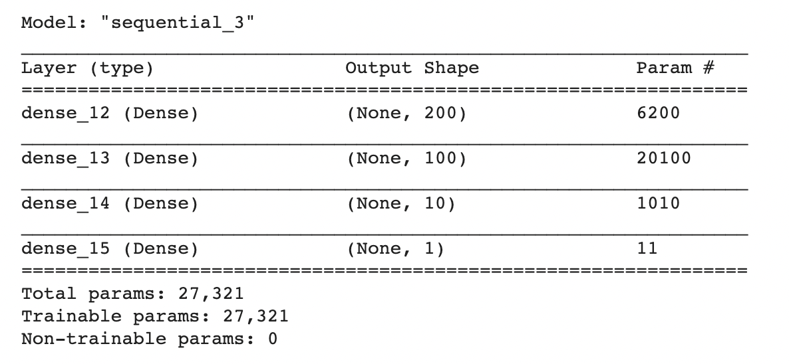
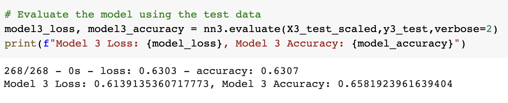

# Neural Network Charity Analysis
## Overview
In this project, I demonstrate my knowledge of machine learning and neural networks in Google Colab. I use Python and the Pandas library to preprocess the data and use TensorFlow to create the neural networks. I am creating a binary classifier that is capable of predicting whether an applicant will be successful at a particular funding operation. This project is divided into three deliverables. The first deliverable is preprocessing data for a neural network model. The second is compiling, training, and evaluating the model. The last is optimizing the model. Included with the deliverables is this report. 
## Results
### - Data Preprocessing
In the model, my target is the column titled "IS_SUCCESSFUL". This is my "y" variable. Furthermore, with the exception of columns "EIN" and "NAME" (as they are neither targets nor variables and are removed from input data), the rest of the columns are my features or "X" variable. 
###  - Compiling, Training, Evaluating the Model
During this phase of the project, I evaluated different models on their accuracy and loss. I changed the number of neurons, layers and the activation functions. Even though I was never able to achieve a target performance above 72%, I took the following steps to try to increase the model's performance: 
- eliminated six columns.
- replaced the values to place them in a larger bin
- grouped values to place them in a smaller bin
The following are the results:

## Summary
I can predict which company would be successful at a particular funding operation with 72% accuracy. In order to get a better percentage point that could be used to make a better business decision, I need more data that pertains to each company's past loan practices and performance. In other words, more relevant data to the task at hand. 